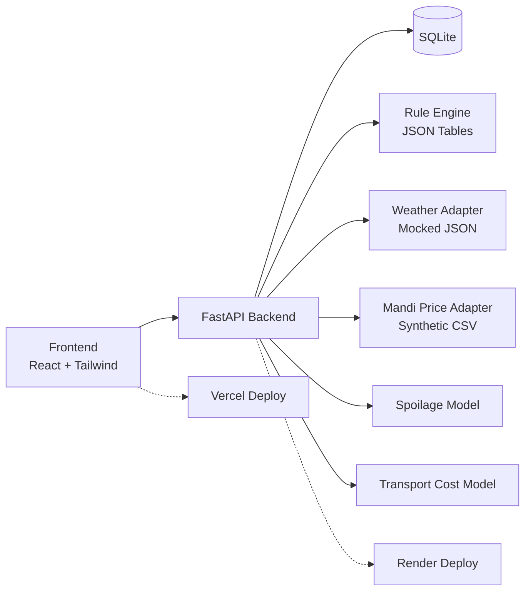

# System Architecture

ArgiTech is designed as a decoupled client-server web application. The frontend is a single-page React app, and the backend is a lightweight FastAPI REST API backed by SQLite and a rule-based logic engine.

---

## Architecture Diagram

---

## Component Descriptions

### 1. Frontend (React + Tailwind CSS)
* **View Routing**: Uses a lightweight view-state pattern (`home` | `form` | `results`) to navigate without full client-side router library bloat.
* **Intake Form**: Implements robust validations (e.g. native date-picker constraints for past dates, field presence checks) and handles loading/submitting states gracefully.
* **Responsive Layout**: Designed mobile-first using Tailwind CSS grid/flex structures to render cleanly on screens as narrow as 375px.

### 2. Backend (FastAPI REST API)
* **Endpoints**: Exposed endpoints include:
  * `GET /health`: Health status.
  * `GET /locations`: Retrieves all 5 seeded Gujarat locations.
  * `GET /crops`: Retrieves all 4 configured crops.
  * `GET /api/rules`: Returns merged crop stages rules (irrigation, fertilizer, pest).
  * `POST /advisory`: Receives farmer session data and processes it through the advisory engine.
* **CORS**: Configured wide-open middleware to handle cross-origin requests seamlessly.

### 3. Database (SQLite + SQLAlchemy)
* **Tables**:
  * `locations`: Store ID, name, state, and geographic coordinates.
  * `crops`: Store crop name, category, and typical duration (in days).
  * `farmer_sessions`: Persists metadata from advisory requests (location ID, crop ID, sowing date, weather observation, photo path) for user session logging.
* **Connection**: Managed with SQLAlchemy Local Session pool utilizing standard SQLite row factories.

### 4. Rule Engine (JSON-backed Rules)
* Located in `Backend/data/`.
* [irrigation_rules.json](file:///D:/.Github/Tetrathon/TetraThon-Prototype/Backend/data/irrigation_rules.json): Stage-specific irrigation frequencies and rain check windows.
* [fertiliser_rules.json](file:///D:/.Github/Tetrathon/TetraThon-Prototype/Backend/data/fertiliser_rules.json): Stage-specific N-P-K (nitrogen, phosphorus, potash) recommendations in kg per acre.
* [pest_rules.json](file:///D:/.Github/Tetrathon/TetraThon-Prototype/Backend/data/pest_rules.json): Stage-specific pest target profiles and weather risk multipliers.

### 5. Adapters & Models
* **Weather Adapter**: Provides a deterministic 7-day forecast configuration mapping temperature waves, humidity, and rainfall chance to locations without external API calls.
* **Mandi Price Adapter (Future)**: Will read synthetic market price CSV data.
* **Decision Models (Future)**: Spoilage curves, transport costs, and net-return computations will be integrated in subsequent modules.

### 6. Deployment
* **Frontend**: Deployed on Vercel.
* **Backend**: Deployed on Render running `uvicorn App.main:app`.
