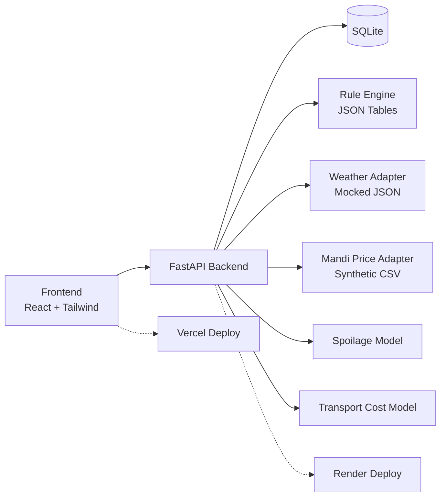

# Chunk 1 — Execution Plan

## Project Foundation & Rule Tables

| Field | Value |
|-------|-------|
| **Owner** | Dhruvin |
| **Timing** | Day 1 (~8 hr net) |
| **Phase** | Phase 0 — Pre-Screening Prototype |
| **Depends on** | Nothing (first chunk) |
| **Deliverable** | Live, deployed app skeleton + seed data + rule tables |

---

## Table of Contents

1. [Repository & Project Scaffold](#1-repository--project-scaffold)
2. [Backend — FastAPI Skeleton](#2-backend--fastapi-skeleton)
3. [Frontend — React (Vite) + Tailwind Skeleton](#3-frontend--react-vite--tailwind-skeleton)
4. [Data Models & SQLite Schema](#4-data-models--sqlite-schema)
5. [Seed Data Loading](#5-seed-data-loading)
6. [Rule Tables (Irrigation, Fertiliser, Pest)](#6-rule-tables-irrigation-fertiliser-pest)
7. [User Flows & Architecture Documentation](#7-user-flows--architecture-documentation)
8. [Deploy to Production](#8-deploy-to-production)
9. [README & Final Push](#9-readme--final-push)
10. [Done Criteria Checklist](#10-done-criteria-checklist)
11. [Handoff to P2 Template](#11-handoff-to-p2-template)
12. [Ponytail Simplification Log](#12-ponytail-simplification-log)

---

## 1. Repository & Project Scaffold

**Timeline:** 30 min | **Dependencies:** None | **Resources:** GitHub account, Git CLI

| # | Task | Description | Output |
|---|------|-------------|--------|
| 1.1 | Create GitHub repository | `tetrathon-krishi-drishti` — public, MIT license | Repo URL |
| 1.2 | Clone locally | `git clone <url>` into working directory | Local folder |
| 1.3 | Create folder structure | `mkdir frontend backend docs data` | Skeleton directories |
| 1.4 | Add `.gitignore` | Python (backend) + Node (frontend) templates | `.gitignore` at root |
| 1.5 | Create root `README.md` | Project title, one-liner, team name, live demo link placeholder | `README.md` |
| 1.6 | Initial commit | `git add . && git commit -m "chore: initial project scaffold"` | First visible commit |

**Reference:** Chunk Plan §1, PRD §15.6

---

## 2. Backend — FastAPI Skeleton

**Timeline:** 45 min | **Dependencies:** 1 (repo scaffolded) | **Resources:** Python 3.11+, pip

### 2.1 File Structure

```
backend/
├── main.py                  # FastAPI app entry point
├── pyproject.toml           # Dependencies & metadata
├── app/
│   ├── __init__.py
│   ├── database.py          # SQLite connection helper
│   ├── models.py            # Pydantic models & dataclasses
│   ├── seed.py              # Seed data functions
│   └── routers/
│       ├── __init__.py
│       ├── health.py        # GET /health
│       ├── locations.py     # GET /api/locations
│       ├── crops.py         # GET /api/crops
│       └── rules.py         # GET /api/rules?crop_id=X
├── data/
│   ├── irrigation_rules.json
│   ├── fertiliser_rules.json
│   └── pest_rules.json
└── requirements.txt
```

### 2.2 Implementation Tasks

| # | Task | Description | Verification |
|---|------|-------------|-------------|
| 2.1 | Create `pyproject.toml` | Dependencies: `fastapi`, `uvicorn[standard]`, `pydantic` | |
| 2.2 | Create `main.py` | FastAPI app with CORS middleware, startup event for DB init | |
| 2.3 | Create `app/__init__.py` | Package marker | |
| 2.4 | Create `app/database.py` | `get_db()` context manager — SQLite with `sqlite3.Row` row factory | |
| 2.5 | Create `app/models.py` | Pydantic models: `Location`, `Crop`, `FarmerSession`, `RuleResponse` | |
| 2.6 | Create `app/routers/health.py` | `GET /health` → `{"status": "OK", "version": "0.1.0"}` | |
| 2.7 | Create `app/routers/__init__.py` | Package marker | |
| 2.8 | Wire routers into `main.py` | `app.include_router(health.router)` pattern | |
| 2.9 | Run & verify | `uvicorn main:app --reload` → `curl localhost:8000/health` returns 200 | |

**Reference:** PRD §9.1 (FastAPI/Python), §15.3

---

## 3. Frontend — React (Vite) + Tailwind Skeleton

**Timeline:** 1 hr | **Dependencies:** 2 (backend running) | **Resources:** Node.js 18+, npm

### 3.1 File Structure

```
frontend/
├── src/
│   ├── App.jsx                # Main app — routes, layout
│   ├── App.css                # Tailwind directives
│   ├── main.jsx               # ReactDOM entry
│   ├── components/
│   │   ├── Layout.jsx         # Header + footer wrapper
│   │   ├── HealthCheck.jsx    # Calls /api/health, shows status
│   │   ├── LocationList.jsx   # Shows 5 locations from backend
│   │   └── CropList.jsx       # Shows 4 crops from backend
│   └── api.js                 # Centralized fetch wrapper
├── index.html
├── vite.config.js             # Tailwind plugin + proxy config
├── package.json
└── tailwind.config.js
```

### 3.2 Implementation Tasks

| # | Task | Description | Verification |
|---|------|-------------|-------------|
| 3.1 | Scaffold Vite project | `npm create vite@latest . -- --template react` | `npm run dev` starts |
| 3.2 | Install & configure Tailwind | Vite plugin config, `@import "tailwindcss"` in CSS | Hot reload shows styles |
| 3.3 | Create `api.js` | Base URL config, `getHealth()`, `getLocations()`, `getCrops()` | |
| 3.4 | Create `HealthCheck.jsx` | Fetch `/api/health` on mount — spinner → green checkmark or red error | |
| 3.5 | Create `Layout.jsx` | Header (project name) + `<main>` slot + footer | |
| 3.6 | Create `LocationList.jsx` | Fetch `/api/locations` — renders card list | |
| 3.7 | Create `CropList.jsx` | Fetch `/api/crops` — renders card list | |
| 3.8 | Assemble `App.jsx` | Layout → HealthCheck + LocationList + CropList | |
| 3.9 | Configure Vite proxy | `server.proxy: { "/api": "http://localhost:8000" }` | No CORS issues in dev |
| 3.10 | Mobile-responsive pass | Tailwind responsive utilities on all components | Looks good at 375px |

**Reference:** PRD §9.1 (React/Vite + Tailwind), §8 (mobile-first NFR)

---

## 4. Data Models & SQLite Schema

**Timeline:** 1 hr | **Dependencies:** 2 (backend exists) | **Resources:** None

### 4.1 Database Schema

```sql
CREATE TABLE IF NOT EXISTS locations (
    id INTEGER PRIMARY KEY AUTOINCREMENT,
    name TEXT NOT NULL,
    state TEXT NOT NULL,
    latitude REAL NOT NULL, 
    longitude REAL NOT NULL,
    market_name TEXT,
    created_at TIMESTAMP DEFAULT CURRENT_TIMESTAMP
);

CREATE TABLE IF NOT EXISTS crops (
    id INTEGER PRIMARY KEY AUTOINCREMENT,
    name TEXT NOT NULL UNIQUE,
    season TEXT NOT NULL,
    typical_days_to_harvest INTEGER NOT NULL,
    created_at TIMESTAMP DEFAULT CURRENT_TIMESTAMP
);

CREATE TABLE IF NOT EXISTS farmer_sessions (
    id INTEGER PRIMARY KEY AUTOINCREMENT,
    location_id INTEGER REFERENCES locations(id),
    crop_id INTEGER REFERENCES crops(id),
    sowing_date TEXT,
    weather_observation TEXT,
    photo_path TEXT,
    created_at TIMESTAMP DEFAULT CURRENT_TIMESTAMP
);
```

### 4.2 Seed Data — 5 Locations

| # | Name | State | Latitude | Longitude | Market |
|---|------|-------|----------|-----------|--------|
| 1 | Anand | Gujarat | 22.5645 | 72.9289 | Anand APMC |
| 2 | Ludhiana | Punjab | 30.9010 | 75.8573 | Ludhiana Mandi |
| 3 | Nagpur | Maharashtra | 21.1458 | 79.0882 | Nagpur APMC |
| 4 | Bengaluru Rural | Karnataka | 13.0300 | 77.5800 | Bengaluru APMC |
| 5 | Patna | Bihar | 25.5941 | 85.1376 | Patna Market Yard |

### 4.3 Seed Data — 4 Crops

| # | Name | Season | Days to Harvest | Notes |
|---|------|--------|----------------|-------|
| 1 | Paddy (Rice) | Kharif | 135 | Water-intensive, distinct pest profile |
| 2 | Wheat | Rabi | 120 | Dry-season crop, rust disease |
| 3 | Cotton | Kharif | 165 | High-value cash crop, bollworm |
| 4 | Groundnut | Kharif | 120 | Oilseed, high spoilage risk |

### 4.4 Implementation Tasks

| # | Task | Description | Verification |
|---|------|-------------|-------------|
| 4.1 | Define `init_db()` in `database.py` | CREATE TABLE IF NOT EXISTS for all 3 tables | |
| 4.2 | Define `seed_locations()` in `seed.py` | Transactional INSERT with 5 rows | |
| 4.3 | Define `seed_crops()` in `seed.py` | Transactional INSERT with 4 rows | |
| 4.4 | Wire `init_db()` to FastAPI lifespan | Call on startup event | |
| 4.5 | Create `GET /api/locations` router | Returns JSON array from SQLite | |
| 4.6 | Create `GET /api/crops` router | Returns JSON array from SQLite | |
| 4.7 | Verify endpoints | 5 locations returned, 4 crops returned | |

**Reference:** Chunk Plan §4, PRD §10, PRD §FR-X2

---

## 5. Seed Data Loading

**Timeline:** 30 min | **Dependencies:** 4 (models defined) | **Resources:** None

| # | Task | Description | Verification |
|---|------|-------------|-------------|
| 5.1 | Implement `get_all_locations()` | Query all from SQLite | |
| 5.2 | Implement `get_all_crops()` | Query all from SQLite | |
| 5.3 | Wire location/crop routers | Connect to seed functions | |
| 5.4 | Wire frontend components | LocationList and CropList call live endpoints | |
| 5.5 | End-to-end test | Frontend loads, shows 5 locations + 4 crops | |

---

## 6. Rule Tables (Irrigation, Fertiliser, Pest)

**Timeline:** 1.5 hr | **Dependencies:** 4 (crops finalized) | **Resources:** ICAR/KVK crop calendars

### 6.1 Research Sources (PRD §10, §17.2)

- ICAR published crop calendars
- KVK district-wise agronomy schedules
- State Agriculture Department advisories (Gujarat, Punjab, Maharashtra, Karnataka, Bihar)

Curated static rule tables are explicitly confirmed for the prototype per PRD §15.2.

### 6.2 File Schema — `data/irrigation_rules.json`

```json
{
  "crop_name": "paddy",
  "growth_stages": [
    {
      "name": "Nursery",
      "day_range": [1, 20],
      "water_cm_per_week": 5.0,
      "frequency_days": 1,
      "advisory_template": "Your {crop} is in the {stage} stage. Apply {water_cm}cm of water every {freq} day(s)."
    },
    {
      "name": "Tillering",
      "day_range": [21, 45],
      "water_cm_per_week": 7.5,
      "frequency_days": 1
    },
    {
      "name": "Flowering",
      "day_range": [46, 75],
      "water_cm_per_week": 10.0,
      "frequency_days": 1
    },
    {
      "name": "Grain Filling",
      "day_range": [76, 100],
      "water_cm_per_week": 5.0,
      "frequency_days": 2
    },
    {
      "name": "Maturity",
      "day_range": [101, 135],
      "water_cm_per_week": 0,
      "frequency_days": null
    }
  ]
}
```

### 6.3 Rule Coverage Per Crop

| Crop | Growth Stages | Fertiliser Stages | Pest Targets |
|------|---------------|-------------------|--------------|
| Paddy | Nursery, Tillering, Flowering, Grain Filling, Maturity | Basal, Tillering, Flowering | Leaf Folder, Stem Borer, Blast |
| Wheat | Germination, Tillering, Stem Elongation, Heading, Grain Fill | Basal, Tillering, Heading | Rust, Aphid, Powdery Mildew |
| Cotton | Seedling, Vegetative, Flowering, Boll Formation, Maturity | Basal, Vegetative, Flowering | Bollworm, Aphid, Whitefly |
| Groundnut | Germination, Pegging, Flowering, Pod Fill, Maturity | Basal, Pegging, Pod Fill | Leaf Spot, Rust, Stem Rot |

### 6.4 Implementation Tasks

| # | Task | Description | Verification |
|---|------|-------------|-------------|
| 6.1 | Create `data/` directory | In backend | |
| 6.2 | Research & write `irrigation_rules.json` | All 4 crops, 5 stages each | |
| 6.3 | Research & write `fertiliser_rules.json` | All 4 crops, 3 stages each | |
| 6.4 | Research & write `pest_rules.json` | All 4 crops, 3 pests each | |
| 6.5 | Create `GET /api/rules?crop_id=X` router | Loads from JSON, filters by crop | |
| 6.6 | Verify all 4 crops | Each returns structured rules | |

**Reference:** Chunk Plan §6, PRD §FR-A3–A4

---

## 7. User Flows & Architecture Documentation

**Timeline:** 30 min | **Dependencies:** None (can parallelize) | **Resources:** None

### 7.1 Advisory Flow (PRD §11.1)

```
Farmer → Open App → Select Location & Crop → Enter Sowing Date
     → (Optional) Upload Leaf Photo → (Optional) Enter Weather Observation
     → Submit → 3 Ranked Advisories with Confidence + Plain-Language Text
```

### 7.2 Post-Harvest Flow (PRD §11.2)

```
Farmer → Enter Crop, Quantity, Storage Condition, Location
     → System Pulls Prices + Computes Spoilage Curve
     → Sell / Store / Transport Recommendation + Expected Return
     → (Optional) Set Price Alert Threshold
```

### 7.3 Architecture Diagram (Mermaid)



### 7.4 Implementation Tasks

| # | Task | Description | Output |
|---|------|-------------|--------|
| 7.1 | Create `docs/user-flows.md` | Advisory + Post-Harvest text flows | Markdown file |
| 7.2 | Add Mermaid diagram | Architecture visual for README and PPT | |
| 7.3 | Create `docs/architecture.md` | Expanded description for PPT reference | Markdown file |

---

## 8. Deploy to Production

**Timeline:** 1 hr | **Dependencies:** 3, 5 (frontend + backend working) | **Resources:** Vercel account, Render account

### 8.1 Implementation Tasks

| # | Task | Description | Verification |
|---|------|-------------|-------------|
| 8.1 | Create `Procfile` or `render.yaml` | Web service: `uvicorn main:app --host 0.0.0.0 --port $PORT` | |
| 8.2 | Deploy backend to Render | Connect GitHub repo → auto-deploy | Public backend URL |
| 8.3 | Test `/health` on deployed URL | | 200 response |
| 8.4 | Update `api.js` with Render URL | Use `VITE_API_URL` env var | |
| 8.5 | Push to GitHub → triggers Vercel deploy | Or import repo via Vercel dashboard | Public frontend URL |
| 8.6 | Update CORS in backend | Add Vercel domain to `allow_origins` | |
| 8.7 | Full integration test | Frontend loads, shows OK + locations + crops | |

### 8.2 Notes

- Render free tier spins down after 15 min idle → ~30s cold start. Acceptable for demo.
- Vercel frontend has no cold start.
- Alternative: Railway.app (no cold start) — team preference.

**Reference:** PRD §15.3, Chunk Plan §8

---

## 9. README & Final Push

**Timeline:** 30 min | **Dependencies:** 8 (deploy active) | **Resources:** None

### 9.1 README Sections (PRD §15.6)

| Section | Content |
|---------|---------|
| Title | Project name + badge links |
| Problem Statement | 2-3 sentence summary from PRD §3 |
| Architecture | Mermaid diagram from Step 7 |
| Tech Stack | React/Vite, FastAPI, SQLite, Tailwind, Vercel, Render |
| Setup Instructions | Backend + frontend commands |
| Live Demo | Direct link to Vercel frontend |
| Project Structure | Brief tree view |
| Team | Names/roles (placeholders) |
| License | MIT |

### 9.2 Implementation Tasks

| # | Task | Output |
|---|------|--------|
| 9.1 | Write full README | `README.md` |
| 9.2 | Write handoff note for P2 | §11 below |
| 9.3 | Final commit: `feat: complete chunk 1 — foundation + seed + rules + deploy` | |
| 9.4 | Push to GitHub | |

---

## 10. Done Criteria Checklist

- [ ] GitHub repo is public with regular, visible commit history
- [ ] `GET /health` returns `{"status": "OK"}` on live Render URL
- [ ] Frontend deployed on Vercel, loads without errors
- [ ] Frontend health-check shows "Backend OK"
- [ ] `GET /api/locations` returns 5 seeded locations
- [ ] `GET /api/crops` returns 4 seeded crops
- [ ] Both lists visible on frontend homepage
- [ ] `GET /api/rules?crop_id=1` returns structured rules
- [ ] Rule tables exist in `backend/data/` as JSON
- [ ] `docs/user-flows.md` documents both flows
- [ ] `docs/architecture.md` has Mermaid diagram
- [ ] README has setup instructions, live links, architecture diagram
- [ ] Backend CORS configured for Vercel domain
- [ ] No auth required on any endpoint
- [ ] No ORM, no state management, no Docker added

---

## 11. Handoff to P2 Template

```
Built the project skeleton — FastAPI backend + React/Vite frontend + Tailwind CSS.

📍 5 locations seeded: Anand, Ludhiana, Nagpur, Bengaluru Rural, Patna
🌾 4 crops seeded: Paddy, Wheat, Cotton, Groundnut
📋 Rule tables (irrigation, fertiliser, pest) in /backend/data/ as JSON
🧪 Backend API docs: https://tetrathon-api.onrender.com/docs
🌐 Frontend live: https://tetrathon-krishi-drishti.vercel.app
📁 Start your work in: backend/app/routers/ — add POST /advisory there
📁 Weather adapter stub goes in: backend/app/adapters/weather.py

To test Chunk 1 is good: open frontend link → green "OK" appears
→ hit /api/locations and /api/crops → 5 + 4 results returned
→ hit /api/rules?crop_id=1 → JSON rules for Paddy
```

---

## 12. Ponytail Simplification Log

| Shortcut | Skipped | Add When | Location |
|----------|---------|----------|----------|
| No ORM | SQLAlchemy/Tortoise | Query logic grows beyond 3 tables | `backend/app/database.py` |
| No state mgmt | Redux/Zustand | Chunk 2 form state needs persistence | `frontend/src/api.js` |
| No Docker | Dockerfile + compose | Phase 2 — Cloud infra (Chunk 9) | `backend/main.py` |
| No auth | Login/registration | Phase 2 — Field agent access (Chunk 10) | `backend/app/routers/` |
| Static rule tables | DB-backed rules w/ admin UI | Scaling beyond 4 crops | `backend/data/*.json` |
| No test framework | pytest | Chunk 8 — Week 2 hardening | Not applicable |
| No CI/CD | GitHub Actions | Chunk 8 — Week 2 hardening | Not applicable |

---

## Resource Summary

| Resource | Version | Purpose |
|----------|---------|---------|
| Python | 3.11+ | Backend runtime |
| FastAPI | 0.110+ | REST API framework |
| Uvicorn | 0.29+ | ASGI server |
| Node.js | 18+ | Frontend runtime |
| React | 18+ | UI library |
| Vite | 5+ | Build tool |
| Tailwind CSS | 3+ | Utility CSS |
| SQLite | 3.x | Embedded database (stdlib) |
| Vercel | — | Frontend hosting |
| Render | — | Backend hosting |

---

## Risk Register

| Risk | Likelihood | Impact | Mitigation |
|------|-----------|--------|------------|
| Render cold-start delay | High | Low | Note in handoff; warm with cron if needed |
| Commit history too sparse | Medium | Medium | Commit after each step, not end of day |
| Rule research >1.5 hr | Medium | Medium | Timebox; accept 80% accurate rules |
| Crop/location choices conflict | Low | Medium | Rationale documented; swappable in Chunk 4 |

---

## Milestone Summary

| Milestone | Time | Gate |
|-----------|------|------|
| M1 — Repo created, folders scaffolded | T+30 min | `git log` shows first commit |
| M2 — Backend `/health` returns OK | T+1.25 hr | `curl /health` |
| M3 — Frontend loads with health check | T+2.25 hr | Browser shows green checkmark |
| M4 — Seed data flowing (locs + crops) | T+3.25 hr | Frontend shows 5 locs + 4 crops |
| M5 — Rule tables accessible via API | T+5 hr | `/api/rules?crop_id=1` returns JSON |
| M6 — Docs complete | T+5.5 hr | Files in `docs/` |
| M7 — Live on Vercel + Render | T+6.5 hr | Public URL works end-to-end |
| M8 — README + final push | T+7 hr | GitHub up to date |
