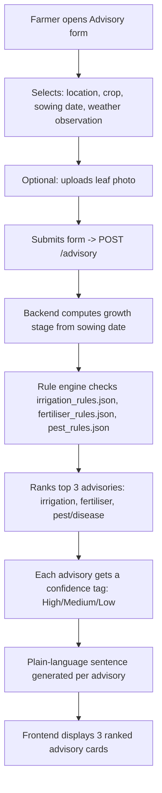
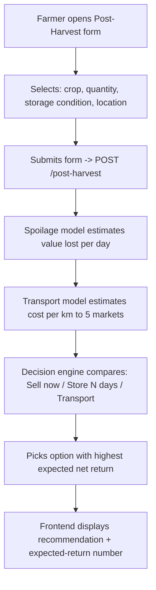
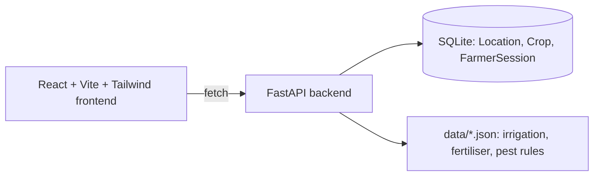

# User Flows

## Flow A — Crop Advisory

```mermaid
flowchart TD
    A[Farmer opens Advisory form] --> B[Selects: location, crop, sowing date, weather observation]
    B --> C[Optional: uploads leaf photo]
    C --> D[Submits form -> POST /advisory]
    D --> E[Backend computes growth stage from sowing date]
    E --> F[Rule engine checks irrigation_rules.json, fertiliser_rules.json, pest_rules.json]
    F --> G[Ranks top 3 advisories: irrigation, fertiliser, pest/disease]
    G --> H[Each advisory gets a confidence tag: High/Medium/Low]
    H --> I[Plain-language sentence generated per advisory]
    I --> J[Frontend displays 3 ranked advisory cards]
```

## Flow B — Post-Harvest Loss Planner

```mermaid
flowchart TD
    A[Farmer opens Post-Harvest form] --> B[Selects: crop, quantity, storage condition, location]
    B --> C[Submits form -> POST /post-harvest]
    C --> D[Spoilage model estimates value lost per day]
    D --> E[Transport model estimates cost per km to 5 markets]
    E --> F[Decision engine compares: Sell now / Store N days / Transport]
    F --> G[Picks option with highest expected net return]
    G --> H[Frontend displays recommendation + expected-return number]
```

## Shared foundation (Chunk 1)

```mermaid
flowchart LR
    FE[React + Vite + Tailwind frontend] -->|fetch| BE[FastAPI backend]
    BE --> DB[(SQLite: Location, Crop, FarmerSession)]
    BE --> RULES[data/*.json: irrigation, fertiliser, pest rules]
```