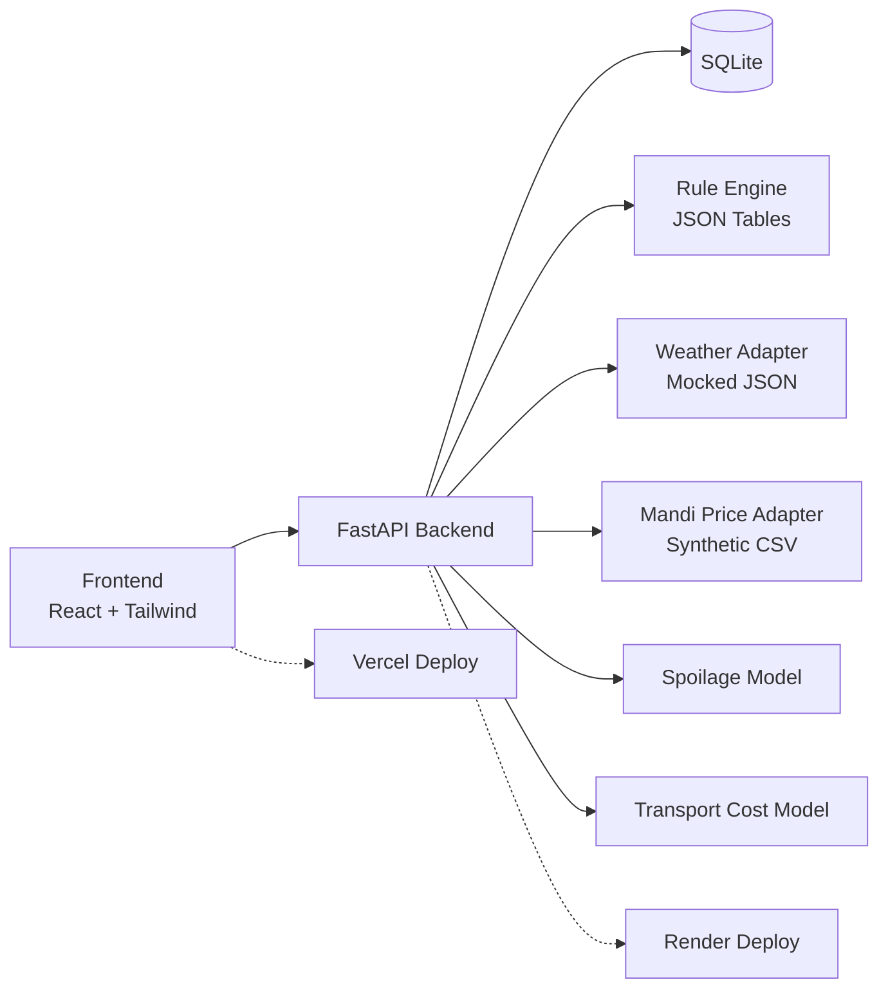

`# ArgiTech — Precision Crop Advisory & Post-Harvest Planner

An integrated platform for smallholder farmers: personalised crop advisories and post-harvest decision support, built for the ArgiTech pre-screening round.

## Problem

India's 85%+ smallholder farmers lack personalised agronomic advice, and 15–20% of produce is lost post-harvest due to poor storage and market-timing decisions. This prototype addresses both gaps with a single, demoable web application.

## Features

- **Crop Advisory Engine** — Enter location, crop, and sowing date → get 3 ranked advisories (irrigation, fertiliser, pest/disease) with confidence scores and plain-language explanations
- **Post-Harvest Planner** — Enter crop, quantity, storage condition → get Sell / Store / Transport recommendation with expected-return estimate, spoilage curves, and price trends
- **4 crop types** × **5 locations** covered end-to-end
- Mocked weather and market-price data — live API swap without UI changes

## Tech Stack

| Layer | Technology |
|-------|-----------|
| Frontend | React 18, Vite, Tailwind CSS 3 |
| Backend | Python 3.11+, FastAPI, SQLAlchemy, SQLite |
| Charts | Recharts |
| Hosting | Vercel (frontend), Render (backend) |

## Architecture



## Project Structure

```
Backend/
├── App/          # FastAPI app — routes, models, engine, adapters
├── Rules/        # Irrigation, fertiliser, pest rule tables (JSON)
└── data/         # Synthetic market-price and weather data
Frontend/
├── src/
│   ├── components/   # UI components
│   └── api.js        # Backend API client
Docs/             # Execution plans, user flows, architecture
```

## Setup

### Backend

```bash
cd Backend
pip install -r requirements.txt
uvicorn App.main:app --reload
# → http://localhost:8000/docs
```

### Frontend

```bash
cd Frontend
npm install
npm run dev
# → http://localhost:5173
```

## Committers

- **Om B Patel** — `ombpatel`
- **Dhruvin Patel** — `Dhruvinpatel06`

Built for **ArgiTech** — AgriTech Track, Navrachana University.

## License

[MIT](./LICENSE)
