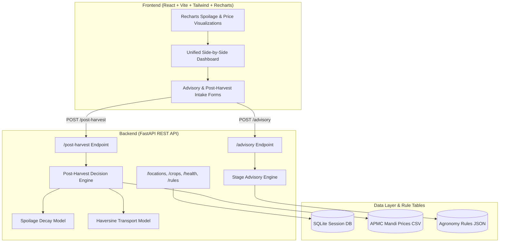

# ArgiTech - Precision Agriculture & Post-Harvest Decision Engine

[](https://github.com/Dhruvinpatel06/TetraThon-Prototype)
[](https://github.com/Dhruvinpatel06/TetraThon-Prototype)
[](https://github.com/Dhruvinpatel06/TetraThon-Prototype)
[](./LICENSE)

> **ArgiTech** is an integrated dual-engine decision-support platform engineered to empower smallholder farmers with stage-aware, weather-responsive crop advisories and algorithmic post-harvest loss minimization strategies.

---

## Project Overview

India's 85%+ smallholder farming ecosystem experiences severe income leakage due to two distinct, unaddressed vulnerabilities:

1. **In-Season Yield Penalties (20–30% Yield Loss)**  
   Conventional agricultural extension services provide static, generic advice. Farmers lack stage-specific recommendations that adapt dynamically to 7-day local weather forecasts, resulting in sub-optimal irrigation timing, fertilizer waste, and delayed pest management.

2. **Post-Harvest Financial Loss (15–25% Produce Waste)**  
   After harvest, farmers struggle to make optimal financial decisions regarding whether to **Sell Immediately**, **Store Produce** to wait for price rebounds, or **Transport to Regional Markets** offering higher prices. Without quantitative models evaluating spoilage decay curves against transport costs, farmers incur significant net value loss.

**ArgiTech** unifies both solutions into a single, high-performance web application powered by a **Stage-Aware Crop Advisory Engine** and an **Algorithmic Post-Harvest Decision Engine**.

---

## Key Features

### 1. Stage-Aware Precision Crop Advisory Engine (Module A)
* **Growth Stage Computation**: Automatically determines crop growth stage based on sowing date and crop duration metadata.
* **Multi-Factor Rule Engine**: Evaluates JSON agronomic matrices for Irrigation, NPK Fertilization, and Pest/Disease risks alongside 7-day weather outlooks.
* **Confidence Scoring**: Assigns High, Medium, or Low confidence ratings to recommendations based on rule-matching precision.
* **Actionable Advice**: Generates plain-language, field-ready instructions (e.g. precise irrigation depth, dosage per acre, disease warnings).

### 2. Post-Harvest Loss & Logistics Planner (Module B)
* **Spoilage Decay Modeling**: Simulates 30-day quality and value degradation across **Open Field**, **Warehouse**, and **Cold Storage** conditions.
* **Haversine Transport Logistics**: Calculates real-world transport costs (₹5/km/quintal) from local farms to 5 regional APMC Mandi markets using coordinate math.
* **Net Return Optimization**: Compares expected net revenue across **Sell Now**, **Store N Days**, and **Transport to Market X**, highlighting the highest financial return option.

### 3. Unified Dashboard & Interactive Visualizations
* **Side-by-Side Evaluation**: View live agronomic advisories and post-harvest financial strategies concurrently in a responsive layout.
* **Recharts Analytics**: Interactive line charts depicting 30-day spoilage decay curves and 90-day APMC market price trends.
* **1-Click Presets**: Pre-populated test scenarios for rapid demonstration across different Gujarat locations and crops.

---

## Tech Stack & Architecture

| Tier | Technologies / Frameworks | Description |
| :--- | :--- | :--- |
| **Frontend** | React 18, Vite 5, Tailwind CSS 3.4, Recharts 2.12 | Responsive client dashboard, forms, and dynamic data visualization |
| **Backend** | Python 3.11+, FastAPI 0.110+, Uvicorn | Async REST API server handling request validation and execution engines |
| **Data Layer** | SQLite (SQLAlchemy 2.0 ORM), APMC Price CSV (1,800 rows) | Session logs, regional location coordinates, crop rules, historical mandi prices |
| **Engines** | Custom Stage Advisory Engine, Haversine Logistics, Spoilage Model | Deterministic agronomy logic, spatial math, and economic optimization models |

### System Architecture Diagram



---

## API Endpoints Specification

All API endpoints return JSON responses. OpenAPI / Swagger documentation is auto-generated at `http://localhost:8000/docs`.

| Method | Endpoint | Description | Sample Params / Payload |
| :--- | :--- | :--- | :--- |
| `GET` | `/health` | Live backend health status check | N/A |
| `GET` | `/locations` | List supported APMC locations (Ahmedabad, Surat, Vadodara, Rajkot, Anand) | N/A |
| `GET` | `/crops` | List supported crop types (Cotton, Wheat, Groundnut, Tomato) | N/A |
| `GET` | `/rules` | Retrieve raw agronomic JSON rule matrices | `?crop_name=Cotton` |
| `POST` | `/advisory` | Compute stage-aware agronomic advisories | `{ "location_id": 1, "crop_id": 1, "sowing_date": "2026-05-15", ... }` |
| `POST` | `/post-harvest` | Calculate optimal financial returns (Sell vs Store vs Transport) | `{ "crop_id": 1, "quantity_quintals": 50, "storage_condition": "warehouse", ... }` |

---

## Installation & Setup Guide

### Prerequisites
* **Python**: `3.11` or `3.12` (recommended)
* **Node.js**: `18.0` or higher
* **npm**: `9.0` or higher

### 1. Backend Setup

Open a terminal and navigate to the `Backend` directory:

```bash
# Navigate to the Backend directory
cd Backend

# Create a virtual environment (optional)
python -m venv .venv

# Activate virtual environment
# Windows (CMD / PowerShell):
.venv\Scripts\activate
# macOS / Linux:
source .venv/bin/activate

# Install Python requirements
pip install -r requirements.txt

# Start FastAPI development server
uvicorn App.main:app --reload --port 8000
```
*Backend server runs at `http://localhost:8000` (Swagger API Docs: `http://localhost:8000/docs`).*

### 2. Frontend Setup

Open a second terminal window and navigate to the `Frontend` directory:

```bash
# Navigate to the Frontend directory
cd Frontend

# Install Node dependencies
npm install

# Start Vite development server
npm run dev
```
*Frontend web application runs at `http://localhost:5173`.*

---

## Usage Guide

### 1. Generating Crop Advisories (Module A)
1. Open `http://localhost:5173` in your browser.
2. Click **Crop Advisory** from the home page.
3. Pick your **Location** (e.g. *Anand*), **Crop** (e.g. *Cotton*), **Sowing Date**, and recent **Weather Observation**.
4. Click **Generate Advisory** to view 3 ranked advisories (Irrigation, Fertilizer, Pest Risk) complete with confidence badges and field-ready instructions.

### 2. Planning Post-Harvest Strategy (Module B)
1. Click **Post-Harvest Plan** from the home page.
2. Enter your **Crop Quantity** (in quintals) and select your **Storage Condition** (Open Yard, Warehouse, Cold Storage).
3. Click **Calculate Financial Plan**.
4. Review the optimal recommendation (**Sell Now**, **Store N Days**, or **Transport to APMC Mandi**) along with expected net returns and interactive Recharts decay/price trend charts.

### 3. Unified Dashboard (Module A + B Combined)
1. Click **Open Unified Dashboard** from the home page.
2. Fill in **Location**, **Crop**, **Sowing Date**, **Weather Observation**, **Produce Quantity**, and **Storage Condition** — or pick a **1-Click Preset** to auto-fill.
3. Optionally upload a **Leaf Image** for AI-assisted disease classification.
4. Click **Evaluate Unified Scenario** to view both crop advisory and post-harvest financial results side-by-side with interactive charts.

---

## Screenshots

> All screenshots live in [`docs/screenshots/`](./docs/screenshots/). Replace placeholders with actual captures.

### Home Page


---

### Module A — Crop Advisory

| Input Form | Results |
|:---:|:---:|
|  |  |

---

### Module B — Post-Harvest Planner

| Input Form | Results |
|:---:|:---:|
|  |  |

---

### Unified Dashboard

| Input Form | Results |
|:---:|:---:|
|  |  |

---

## Contribution Guidelines

Contributions are welcome! Please follow these steps:

1. **Fork the Repository**: Click the **Fork** button at the top right of this page.
2. **Create a Feature Branch**:
   ```bash
   git checkout -b feature/amazing-feature
   ```
3. **Commit Your Changes**: Follow clear commit standards.
   ```bash
   git commit -m "feat: Add new market price integration adapter"
   ```
4. **Push to Your Branch**:
   ```bash
   git push origin feature/amazing-feature
   ```
5. **Open a Pull Request**: Submit a PR to the `main` branch with a summary of changes and testing verification steps.

---

## Team & Acknowledgments

Built for **TetraTHON 2026** - Precision AgriTech Track.

* **Om B Patel** ([@byt-ctrl](https://github.com/byt-ctrl))
* **Mithil Desai** ([@mithildesai24](https://github.com/PixelPirate-24))
* **Dhruvin Patel** ([@Dhruvinpatel06](https://github.com/Dhruvinpatel06))
* **Saumya Thakur** ([@SaumyaThakur1226](https://github.com/SaumyaThakur1226))

---

## License Information

Distributed under the MIT License. See [`LICENSE`](./LICENSE) for full licensing information.
