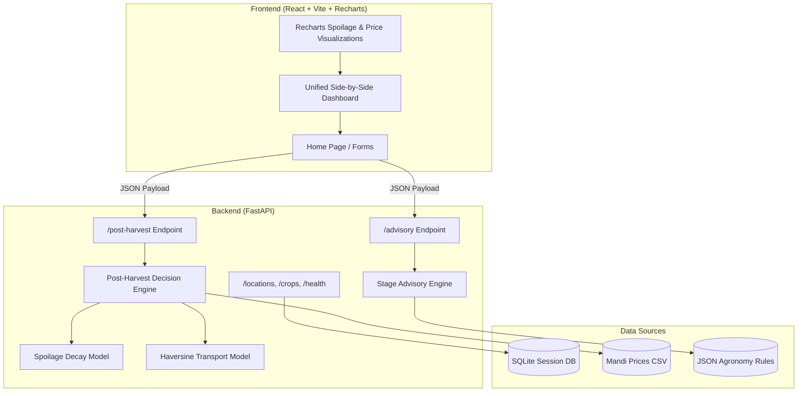

# AgriTech — Precision Agriculture & Post-Harvest Decision Engine

[](https://github.com/Dhruvinpatel06/TetraThon-Prototype)
[](https://github.com/Dhruvinpatel06/TetraThon-Prototype)
[](https://github.com/Dhruvinpatel06/TetraThon-Prototype)

> An integrated dual-engine decision support platform empowering smallholder farmers with personalized stage-specific crop advisories and post-harvest loss minimization algorithms.

---

## Problem & Value Proposition

India's 85%+ smallholder farmers face two major vulnerabilities:
1. **In-Season Yield Penalties (20–30% loss):** Generic farming advice ignores local crop growth stages and 7-day weather forecasts, resulting in inefficient water and fertilizer applications.
2. **Post-Harvest Produce Loss (15–25% waste):** Lack of financial decision engines comparing immediate sale, 14-day storage decay, and transport costs to higher-paying regional markets.

**AgriTech** solves both in a single unified web platform with real-time interactive analytics.

---

## Key Features

* **Module A: Precision Crop Advisory Engine** — Computes crop growth stage from sowing date and ranks top 3 advisories (Irrigation depth & interval, NPK fertilizer dosages per acre, Pest/Disease risk alerts) with confidence scores.
* **Module B: Post-Harvest Loss Planner** — Evaluates net financial returns across 3 options (**Sell Now**, **Store 14 Days**, **Transport to Best Market**) considering Haversine transport costs (₹5/km/q) and spoilage decay models.
* **Unified Side-by-Side Dashboard** — Displays Module A and Module B results concurrently in a single 2-column view with 1-click evaluation presets.
* **Interactive Visualizations (Recharts)** — Renders 30-day spoilage decay curves (Open Field vs Warehouse vs Cold Storage) and 90-day APMC Mandi market price trends across Gujarat.

---

## Tech Stack

| Layer | Technology |
|-------|-----------|
| **Frontend** | React 18, Vite 5, Tailwind CSS 3.4, Recharts 2.12 |
| **Backend** | Python 3.11+, FastAPI 0.110+, Uvicorn |
| **Data Layer** | SQLite (SQLAlchemy 2.0 ORM), CSV Mandi Price Database (1,800 rows) |
| **Engines** | Stage-Ranking Advisory Engine, Exponential Spoilage Model, Haversine Transport Model |

---

## System Architecture



---

## API Endpoints Specification

| Method | Endpoint | Description |
|--------|----------|-------------|
| `GET` | `/health` | Live backend health status check |
| `GET` | `/locations` | List 5 Gujarat APMC locations (Ahmedabad, Surat, Vadodara, Rajkot, Anand) |
| `GET` | `/crops` | List 4 supported crop types (Cotton, Wheat, Groundnut, Tomato) |
| `POST` | `/advisory` | Compute stage-aware crop advisory recommendations |
| `POST` | `/post-harvest` | Calculate financial net return decision across Sell / Store / Transport |
| `GET` | `/rules` | Retrieve raw agronomic JSON rule matrices |

---

## Quick Start Guide

### Prerequisites
* **Python 3.11+**
* **Node.js 18+**

All commands run from the project root `TetraThon-Prototype/`.

### 1. Start FastAPI Backend

```bash
cd Backend

# Create and activate virtual environment
python -m venv .venv

# On Windows (PowerShell):
.venv\Scripts\activate

# On macOS/Linux:
source .venv/bin/activate

# Install dependencies
pip install -r requirements.txt

# Start backend server
uvicorn App.main:app --reload --port 8000
```
*Backend runs on `http://localhost:8000` (Swagger docs: `http://localhost:8000/docs`).*

### 2. Start React Frontend

In a separate terminal:

```bash
cd Frontend
npm install
npm run dev
```
*Frontend runs on `http://localhost:5173`.*

---

## Team & Submission Credits

Built for **TetraTHON 2026** — Precision AgriTech Track.

* **Om B Patel** ([@byt-ctrl](https://github.com/byt-ctrl))
* **Mithil Desai** ([@mithildesai24](https://github.com/PixelPirate-24))
* **Dhruvin Patel** ([@Dhruvinpatel06](https://github.com/Dhruvinpatel06))
* **Saumya Thakur** ([@SaumyaThakur1226](https://github.com/SaumyaThakur1226))

---

## License

[MIT](./LICENSE)
